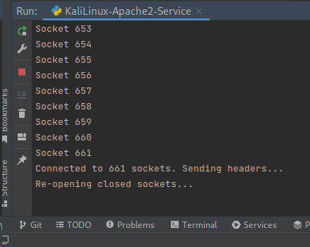
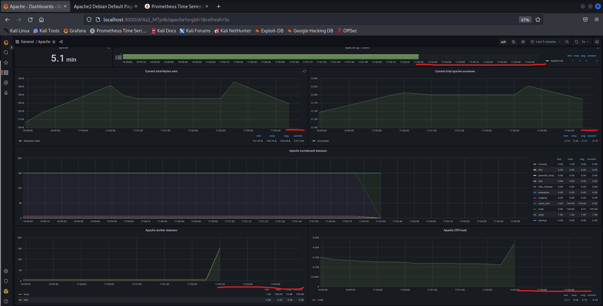
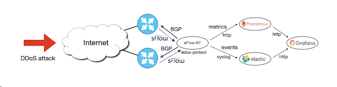
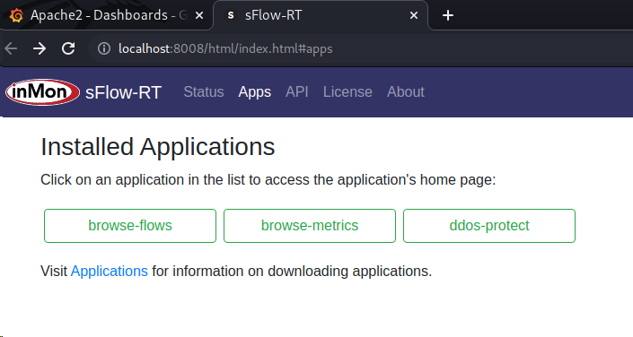

## Botdos en python pour Linux

```
  Ce script a été développé pour un projet académique et il ne doit pas être utilisé en dehors de ce cadre. 
```
```
Prérequis pour Attaque ICMP Flood et Slowloris. 
```
-	Wireshark (pour l’analyse du trafic) 
-	Xterm (Pour affichage des commandes dans une fenêtre externe à la console principale) 
```
1.	Installation du script 

        Comment utiliser le projet depuis Github : https://github.com/kali973/BotDos.git 

-	Faire le clone du folder BotDdos en utilisant votre IDE ou bien  
-	Exécuter les commandes suivant depuis votre terminale.

2.	Lancement du script 

        Le fichier dosattack.py est celui qui lance tout le programme. 
        Voici la commande python qui nous permet de lancer notre script. 

```
git clone https://github.com/kali973/BotDos.git

cd botDos

python dosattack.py


Les Options [5], [6], [7] et [8] sont les options principales de ce bot pour faire du Ping Flood (ICMP Flooding) ou du slowloris . 
```
     •	Option 5 :
      
     [5] :   Cette option nous montre l’adresse IP de la machine qui l’utilise pour ainsi connaitre le reseau dans lequel on se trouve : elle correspond à la commande ifconfig du terminal.    
             En lançant l’option 5 on exécute le programme ifConfigpython.py ( Voir code en Annexe ) . 

    •	Option 6 : 

     [6] :  Dans cette option , un scan de réseau est fait à l’ aide de la librairie python-nmap pour voir les machines hôtes connectés, la liste des ports et leur statuts. 
            Cette options permet à l’attaquant de choisir sa machine cible.  Le programme exécuter dans cette option est notre programme nmap.py  
            Ce programme utilise la bibliothèque "nmap" pour numériser une plage d'adresses IP et une plage de ports spécifiées par l'utilisateur. Le programme initialise un scanner de ports avec nmap, puis scanne la plage d'adresses IP spécifiée pour la plage de ports spécifiée. Enfin, le programme imprime les résultats de la numérisation, y compris l'état de chaque port trouvé pour chaque adresse IP.

    •	Option [7]

     [7] :  Une fois que la machine cible choisi, avec cette option 7 on lance l’attaque ICMP Flooding en se basant sur scapy. L’option 7 exécute donc le programme icmpflooding.py 

    •	Option [8]

     [8] :  Cette option permet à l’attaquant de lancer l’attack slowloris en exécutant le programme slowloris.py . 

     Autres Options.

    •	Teste en local de l’attaque Slowloris :
  
        Pour tester son propre serveur apache2 en local on peut utiliser les Options 1, 2, 3 et 4 avant de faire l’attaque slowloris pour tester. 

           [1] : Cette Option démarre le serveur apache sur la machine local en exécutant la commande  suivante : 
           [2] : Cette Option permet d’arrêter le serveur apache2 sur la machine local en exécutant la commande : 
           [3] : Celle-ci permet de redémarrer le server apache 2 sur la machine local  avec la commande : 
           [4] : Cette option affiche le localhost via Mozilla pour pouvoir la page d’accueil du serveur Apache2 sur la machine locale. 

           Une fois que ce Serveur est lancé, l’utilisateur peut choisir L’option 8 pour lancer l’attaque Slowloris sur son propre Serveur Apache2 et essayer de rafraichir la page pour constater l’inactivité du serveur et donc l’impact de l’attaque sur son localhost ou 127.0.0.1/

           Utilisation des outils de Detection 
           
           Pre requis : 
           
           [A] :  L’option A permet de lancer les outils de detection d’attaque Dos comme grafana, le plugin Apache explorer et prométheus.  Ces outils sont décrits dans la partie méthode de detection qui suit. 
           [A] :  Cette option installe de façons successive les différentes briques permettant d’analyser le bon fonctionnement d’un serveur . 
           
           Il s’agit de :   Grafana entreprise, Prometheus, Alerte manager, influx DB et apache exporter.  

           ## Quelle est la différence entre une attaque DDoS Slowloris et une attaque DDoS d'application traditionnelle ?
```
```
 Les attaques DDoS d'application traditionnelles sont conçues pour faire tomber un serveur en l'inondant d'un nombre écrasant de requêtes HTTP,
 ce qui nécessite des ressources substantielles de la part du pirate.
 
 En revanche, une attaque Slowloris peut ne nécessiter que quelques centaines de requêtes à intervalles longs, faibles et réguliers, plutôt que 
 des dizaines de milliers de requêtes HTTP en continu. La bande passante n'est pas une mesure clé dans la détection de ce type d'attaque DDoS.
 
 Les équipes de sécurité doivent plutôt évaluer le nombre standard de tentatives de connexion, les connexions ouvertes, les pools de connexion, les requêtes HTTP entrantes,
 les requêtes HTTP partielles, le nombre maximal de connexions autorisées par adresse IP source, les équilibreurs de charge gérant les tables de session,
 l'infrastructure de journalisation des serveurs Web et les autres chemins réseau ou système dans la DMZ.
```

## Comment se déroule une attaque Slowloris ?

```
 Une attaque Slowloris se déroule en quatre étapes :
 
    - Le pirate transmet des instructions de commande et de contrôle à son botnet ou à ses proxys inverses, qui envoient de multiples requêtes HTTP, incluent des en-têtes aléatoires et utilisent d'autres techniques de contournement, tout en ouvrant de nombreuses connexions à un serveur ciblé depuis leurs réseaux mondiaux.
    - Le serveur ciblé ouvre une connexion TCP pour chaque demande, en prévoyant de fermer le thread dès que la demande HTTP est terminée. Le serveur interrompt toute connexion excessivement longue afin de libérer le thread pour les demandes suivantes.
    - Pour empêcher la fermeture des threads, le pirate envoie par intermittence des en-têtes de requête partiels ou des requêtes HTTP supplémentaires pour maintenir le serveur Web ciblé en activité et le convaincre d'attendre que la requête HTTP soit terminée.
    - En attendant que d'autres requêtes HTTP et connexions TCP soient lancées, le serveur cible finit par manquer de connexions disponibles et ne plus pouvoir répondre aux requêtes du trafic légitime, ce qui entraîne un déni de service.
```

Before Dos Attack


Attack Dos SlowLoris



After Dos Attack the server Apache is out,
we can see any metric on dashboard during the attack Dos (red line)



## DoS protection

```
DoS Protect est une solution légère qui utilise des fonctionnalités de télémétrie et de contrôle standard (sFlow et BGP)
des routeurs pour bloquer automatiquement les attaques par déni de service volumétrique perturbatrices.

Vous pouvez évaluer rapidement la technologie sur votre ordinateur portable ou dans un laboratoire de test.
La solution exploite les fonctionnalités standard du matériel de routage moderne pour s'adapter facilement aux grands réseaux à fort trafic.
```



```
DoS Protect est une solution légère qui utilise des fonctionnalités de télémétrie et de contrôle standard (sFlow et BGP)
des routeurs pour bloquer automatiquement les attaques par déni de service volumétrique perturbatrices.

Vous pouvez évaluer rapidement la technologie sur votre ordinateur portable ou dans un laboratoire de test.
La solution exploite les fonctionnalités standard du matériel de routage moderne pour s'adapter facilement aux grands réseaux à fort trafic.

```

## Getting Started

```
Essayez les analyses en temps réel de sFlow-RT en suivant les étapes de ce guide.```

# Step 1: Installation sFlow-RT

```
Follow the download and installation instructions for your platform.
```

# Step 2: Installation applications

```
Commencez par installer les applications de métriques de navigation et de flux de navigation :
```

```
sudo /usr/local/sflow-rt/get-app.sh sflow-rt browse-metrics
sudo /usr/local/sflow-rt/get-app.sh sflow-rt browse-flows
```

# Restart sFlow-RT to load the applications:

```
sudo systemctl restart sflow-rt
```

# Step 3: Access user interface

```
L'interface utilisateur est accessible à l'aide d'un navigateur Web. Connectez-vous au port HTTP 8008 sur l'hôte exécutant sFlow-RT,
par exemple http://localhost:8008 si vous exécutez le logiciel sur votre ordinateur portable/de bureau.

La page d'état de sFlow-RT affiche des mesures clés sur la santé et les performances de sFlow-RT.```

# Step 4: Configure / deploy agents

```
l'agent décrit comment configurer sFlow dans les périphériques réseau existants et/ou déployer des agents pour surveiller les hôtes,
hyperviseurs, conteneurs, clusters Swarm et Kubernetes. Utilisez la page d'état de sFlow-RT pour vérifier que sFlow
la télémétrie est reçue.

Si vous ne disposez pas d'un accès immédiat à un réseau, les métriques réseau et système en temps réel en tant que service décrivent
comment relire les données sFlow capturées pour explorer les capacités du logiciel sur votre ordinateur portable. Alternativement,
sflow-rt/containerlab comprend des projets qui émulent les réseaux leaf et spine, EVPN et l'atténuation DDoS,
qui peut être exécuté sur un ordinateur portable à l'aide de Docker Desktop.
```

# Step 5: Explore data

```
Access the sFlow-RT user interface.
```

# botdos

# botdos

# botdos
# botdos
# BotDos
