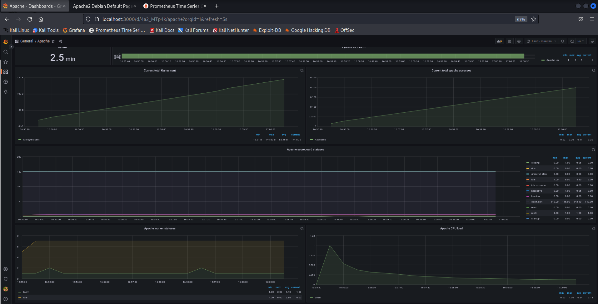

## Apache2 Service for Kali Linux

Only for Kali Linux


## Clone and Use !

Use this command on Linux Terminal !

```
git clone https://github.com/kali973/botdosSym.git
cd botdosSym
python ddosattack.py
```

## Apache Prometheus Dashboard to check Ddos Attack


### Step 1: Install Apache Prometheus exporter

Install curl utility if not already present in your machine

```
sudo apt update && sudo apt install wget curl
curl -s https://api.github.com/repos/Lusitaniae/apache_exporter/releases/latest|grep browser_download_url|grep linux-amd64|cut -d '"' -f 4|wget -qi -
```

Extract downloaded archive

```
tar xvf apache_exporter-*.linux-amd64.tar.gz
sudo cp apache_exporter-*.linux-amd64/apache_exporter /usr/local/bin
sudo chmod +x /usr/local/bin/apache_exporter
```

### Step 2: Create Apache exporter service

```
sudo groupadd --system prometheus
sudo useradd -s /sbin/nologin --system -g prometheus prometheus
```

Then proceed to create a systemd service unit file

```
sudo vim /etc/systemd/system/apache_exporter.service
```

Add below content

```
[Unit]
Description=Prometheus
Documentation=https://github.com/Lusitaniae/apache_exporter
Wants=network-online.target
After=network-online.target

[Service]
Type=simple
User=prometheus
Group=prometheus
ExecReload=/bin/kill -HUP $MAINPID
ExecStart=/usr/local/bin/apache_exporter \
  --insecure \
  --scrape_uri=http://localhost/server-status/?auto \
  --telemetry.address=0.0.0.0:9117 \
  --telemetry.endpoint=/metrics

SyslogIdentifier=apache_exporter
Restart=always

[Install]
WantedBy=multi-user.target
```

Install daemonize package

```
sudo apt-get -y install daemonize
```

Create Arguments configuration file

```
sudo vim /etc/sysconfig/apache_exporter
```

Add

```
ARGS="--insecure --scrape_uri=http://localhost/server-status/?auto --telemetry.address=0.0.0.0:9117 --telemetry.endpoint=/metrics"
```

### Step 3: Start Apache exporter service

For Systemd

```
sudo systemctl daemon-reload
sudo systemctl start apache_exporter.service
sudo systemctl enable apache_exporter.service
```

For Init systems without Systemd

```
sudo /etc/init.d/apache_exporter start
sudo chkconfig apache_exporter on
```

You can verify service status using

```
### Systemd ###
$ systemctl status apache_exporter.service
● apache_exporter.service - Prometheus
     Loaded: loaded (/etc/systemd/system/apache_exporter.service; enabled; vendor preset: enabled)
     Active: active (running) since Wed 2021-09-01 10:12:33 UTC; 9s ago
       Docs: https://github.com/Lusitaniae/apache_exporter
   Main PID: 14652 (apache_exporter)
      Tasks: 6 (limit: 2340)
     Memory: 2.6M
        CPU: 5ms
     CGroup: /system.slice/apache_exporter.service
             └─14652 /usr/local/bin/apache_exporter --insecure --scrape_uri=http://localhost/server-status/?auto --telemetry.address=0.0.0.0:9117 --telemetry.endpoint=/metrics

Sep 01 10:12:33 debian-bullseye-01 systemd[1]: Started Prometheus.
Sep 01 10:12:33 debian-bullseye-01 apache_exporter[14652]: time="2021-09-01T10:12:33Z" level=info msg="Starting apache_exporter (version=0.10.0, branch=HEAD, revision=c64b4496c4658d72c58fbda905a70c>
Sep 01 10:12:33 debian-bullseye-01 apache_exporter[14652]: time="2021-09-01T10:12:33Z" level=info msg="Build context (go=go1.16.6, user=root@2ec369d6fc9a, date=20210729-10:04:27)" source="apache_ex>
Sep 01 10:12:33 debian-bullseye-01 apache_exporter[14652]: time="2021-09-01T10:12:33Z" level=info msg="Starting Server: 0.0.0.0:9117" source="apache_exporter.go:596"
Sep 01 10:12:33 debian-bullseye-01 apache_exporter[14652]: time="2021-09-01T10:12:33Z" level=info msg="Collect from: http://localhost/server-status/?auto" source="apache_exporter.go:597"
Sep 01 10:12:33 debian-bullseye-01 apache_exporter[14652]: time="2021-09-01T10:12:33Z" level=info msg="listening and wait for graceful stop" source="apache_exporter.go:601"

```

Step 4: Add exporter job to Prometheus

```
Add a job to the Prometheus server for scraping metrics. /etc/prometheus/prometheus.yml

    scrape_interval: 5s
    static_configs:
      - targets: ['localhost:9117']
      
  - job_name: 'influxdb'
    scrape_interval: 5s
    static_configs:
      - targets: ['localhost:9999']
```

Restart prometheus service for scraping to start

```
sudo systemctl restart prometheus
```

Test access to port 9117 from Prometheus server

```
http://localhost:9117/metrics
```

Step 5: Install Grafana

```
sudo apt-get install apt-transport-https software-properties-common
wget -O - https://packages.grafana.com/gpg.key | sudo apt-key add -
sudo add-apt-repository "deb https://packages.grafana.com/enterprise/deb stable main"
sudo apt-get update
sudo apt-get install grafana-enterprise
sudo /bin/systemctl start grafana-server
```

Test access to port 3000 from Grafana server

```
http://localhost:3000
```

Step 6: Install and configure Prometheus

```
sudo apt-get update -y
```

Step 7: Go to the official Prometheus downloads page and get the latest download link for the Linux binary.
prometheus linux download link


Step 8: Download the source using curl, untar it, and rename the extracted folder to prometheus-files

```
curl -LO url -LO https://github.com/prometheus/prometheus/releases/download/v2.41.0/prometheus-2.41.0.linux-amd64.tar.gz
tar -xvf prometheus-2.41.0.linux-amd64.tar.gz
mv prometheus-2.41.0.linux-amd64 prometheus-files
```

Step 9: Create a Prometheus user, required directories, and make Prometheus the user as the owner of those directories

```
sudo useradd --no-create-home --shell /bin/false prometheus
sudo mkdir /etc/prometheus
sudo mkdir /var/lib/prometheus
sudo chown prometheus:prometheus /etc/prometheus
sudo chown prometheus:prometheus /var/lib/prometheus
```

Step 10: Copy prometheus and promtool binary from prometheus-files folder to /usr/local/bin and change the ownership to
prometheus user.

```
sudo cp prometheus-files/prometheus /usr/local/bin/
sudo cp prometheus-files/promtool /usr/local/bin/
sudo chown prometheus:prometheus /usr/local/bin/prometheus
sudo chown prometheus:prometheus /usr/local/bin/promtool
```

Step 11: Move the consoles and console_libraries directories from prometheus-files to /etc/prometheus folder and change
the ownership to prometheus user

```
sudo cp -r prometheus-files/consoles /etc/prometheus
sudo cp -r prometheus-files/console_libraries /etc/prometheus
sudo chown -R prometheus:prometheus /etc/prometheus/consoles
sudo chown -R prometheus:prometheus /etc/prometheus/console_libraries
```

Step 12: Create the prometheus.yml file

```
sudo vim /etc/prometheus/prometheus.yml
```

Step 13: Copy the following contents to the prometheus.yml file

```
global:
  scrape_interval: 10s

scrape_configs:
  - job_name: 'prometheus'
    scrape_interval: 5s
    static_configs:
      - targets: ['localhost:9090']
```

Step 14 : Change the ownership of the file to prometheus user.

```
sudo chown prometheus:prometheus /etc/prometheus/prometheus.yml
```

Step 15: Create a prometheus service file

```
sudo vim /etc/systemd/system/prometheus.service
```

Step 16: Copy the following content to the file

```
[Unit]
Description=Prometheus
Wants=network-online.target
After=network-online.target

[Service]
User=prometheus
Group=prometheus
Type=simple
ExecStart=/usr/local/bin/prometheus \
    --config.file /etc/prometheus/prometheus.yml \
    --storage.tsdb.path /var/lib/prometheus/ \
    --web.console.templates=/etc/prometheus/consoles \
    --web.console.libraries=/etc/prometheus/console_libraries

[Install]
WantedBy=multi-user.target
```

Step 17: Reload the systemd service to register the prometheus service and start the prometheus service

```
sudo systemctl daemon-reload
sudo systemctl start prometheus
```

Test access to port 9090 from Grafana server

```
http://localhost:9090
```

Show the monotoring of server apache with a dashboard


## Ddos Attack with SlowLoris

```
 Une attaque DDoS Slowloris est un type d'attaque par déni de service distribué qui cible la couche 7 du modèle OSI. 

 Ce type de cyber-agression a été conçu pour saturer un ordinateur, un serveur Web, une base de données ou une API 
 unique en ouvrant et en maintenant de nombreuses connexions TCP simultanées vers un FQDN cible et en générant un faible 
 taux et/ou volume de requêtes HTTP ou de connexions HTTP par session connectée. Certaines adresses IP d'attaque lancent 
 de nombreuses tentatives de connexion TCP et utilisent ces connexions ou sessions ouvertes supplémentaires en combinant 
 les demandes entrantes pour épuiser les ressources des applications ou des bases de données. Tirant son nom du loris lent,
 un primate asiatique qui se déplace lentement, une attaque Slowloris peut durer longtemps si elle n'est pas détectée.
 
 Les attaques Slowloris se sont démocratisées grâce à des outils d'attaque courants tels que HOIC (High Orbit Ion Cannon)
 et LOIC (Low Orbit Ion Cannon) utilisés par Anonymous, le gouvernement iranien, Killnet et d'autres groupes de cybercriminels.

 Aujourd'hui, d'autres cybercriminels utilisent ces mêmes techniques, mais avec une infrastructure et un système de commande 
 et de contrôle modernisés.
 
 Ce type d'attaque DDoS est une méthode simple, mais élégante, qui permet à un attaquant de mettre hors service 
 un serveur Web avec un niveau de complexité très faible. C'est la capacité à les identifier et à contrôler la qualité 
 des systèmes de protection qui rend cette attaque par déni de service complexe. Une attaque Slowloris peut être lancée 
 avec une bande passante minimale, est généralement écrite en Python et se révèle extrêmement efficace contre de nombreux 
 types de logiciels de serveurs Web, notamment Apache 1.x et 2.x. Ces types d'attaques ont été conçus 
 pour ressembler à des requêtes légitimes et contourner les filtres de protection.

 Contrairement aux attaques DDoS par réflexion, très gourmandes en bande passante, Slowloris monopolise les ressources 
 du serveur en envoyant des requêtes HTTP qui semblent plus lentes que d'habitude, mais ont l'apparence d'un trafic standard légitime. 
 Les pirates tirent parti d'une caractéristique unique du protocole HTTP : la possibilité pour les clients de diviser les requêtes 
 HTTP GET ou POST en plusieurs paquets ou sessions. Ils utilisent Slowloris pour cibler les serveurs Web en ouvrant 
 plusieurs connexions et en les maintenant ouvertes le plus longtemps possible. Pour ce faire, ils distribuent les requêtes 
 HTTP sur des adresses IP de botnet diversifiées au niveau mondial et multiplient les connexions TCP par source. 
 
 Pour maintenir la connexion ouverte, le logiciel Slowloris peut envoyer des en-têtes HTTP pour chaque requête juste avant que la connexion
 TCP n'expire, provoquant ainsi un déni de service. 

 Le serveur ciblé finit par atteindre la limite de son pool de connexions simultanées et ne peut plus traiter d'autres requêtes
```

## Pourquoi une attaque DDoS Slowloris est-elle efficace ?

```
 Une attaque DDoS Slowloris est considérée comme un déni de service distribué, et peut passer sous les radars des systèmes de détection d'intrusion traditionnel
 en envoyant des paquets de requêtes HTTP légitimes à un faible taux de requêtes par seconde, plutôt que de gros volumes ou un taux élevé de requêtes HTTP par seconde.
 
 De plus, comme le fichier journal ne peut pas être écrit tant qu'une requête n'est pas terminée, Slowloris peut immobiliser un serveur pendant de longues périodes 
 sans qu'une seule entrée n'apparaisse dans le fichier journal et n'attire l'attention de ceux qui le surveillent.
```

## Quelle est la différence entre une attaque DDoS Slowloris et une attaque DDoS d'application traditionnelle ?

```
 Les attaques DDoS d'application traditionnelles sont conçues pour faire tomber un serveur en l'inondant d'un nombre écrasant de requêtes HTTP,
 ce qui nécessite des ressources substantielles de la part du pirate.
 
 En revanche, une attaque Slowloris peut ne nécessiter que quelques centaines de requêtes à intervalles longs, faibles et réguliers, plutôt que 
 des dizaines de milliers de requêtes HTTP en continu. La bande passante n'est pas une mesure clé dans la détection de ce type d'attaque DDoS.
 
 Les équipes de sécurité doivent plutôt évaluer le nombre standard de tentatives de connexion, les connexions ouvertes, les pools de connexion, les requêtes HTTP entrantes,
 les requêtes HTTP partielles, le nombre maximal de connexions autorisées par adresse IP source, les équilibreurs de charge gérant les tables de session,
 l'infrastructure de journalisation des serveurs Web et les autres chemins réseau ou système dans la DMZ.
```

## Comment se déroule une attaque Slowloris ?

```
 Une attaque Slowloris se déroule en quatre étapes :
 
    - Le pirate transmet des instructions de commande et de contrôle à son botnet ou à ses proxys inverses, qui envoient de multiples requêtes HTTP, incluent des en-têtes aléatoires et utilisent d'autres techniques de contournement, tout en ouvrant de nombreuses connexions à un serveur ciblé depuis leurs réseaux mondiaux.
    - Le serveur ciblé ouvre une connexion TCP pour chaque demande, en prévoyant de fermer le thread dès que la demande HTTP est terminée. Le serveur interrompt toute connexion excessivement longue afin de libérer le thread pour les demandes suivantes.
    - Pour empêcher la fermeture des threads, le pirate envoie par intermittence des en-têtes de requête partiels ou des requêtes HTTP supplémentaires pour maintenir le serveur Web ciblé en activité et le convaincre d'attendre que la requête HTTP soit terminée.
    - En attendant que d'autres requêtes HTTP et connexions TCP soient lancées, le serveur cible finit par manquer de connexions disponibles et ne plus pouvoir répondre aux requêtes du trafic légitime, ce qui entraîne un déni de service.
```

Before Ddos Attack



Attack Ddos SlowLoris


After Ddos Attack the server Apache is out,
we can see any metric on dashboard during the attack Ddos (red line)


## Trame Wireshark suspected retransmission when SlowLoris is up


## DDoS protection

```
DDoS Protect is an open source denial of service mitigation tool that uses industry standard sFlow telemetry from routers
to detect attacks and automatically deploy BGP remotely triggered blackhole (RTBH) and BGP Flowspec filters 
to block attacks within seconds
```


```
DDoS Protect is a lightweight solution that uses standard telemetry and control (sFlow and BGP) capabilities 
of routers to automatically block disruptive volumetric denial of service attacks.

You can quickly evaluate the technology on your laptop or in a test lab. 
The solution leverages standard features of modern routing hardware to scale easily to large high traffic networks.
```

## Getting Started

```
Try out sFlow-RT's real-time analytics by following the steps in this guide.
```

# Step 1: Install sFlow-RT

```
Follow the download and installation instructions for your platform.
```

# Step 2: Install applications

```
Start off by installing the browse-metrics and browse-flows applications:
```

```
sudo /usr/local/sflow-rt/get-app.sh sflow-rt browse-metrics
sudo /usr/local/sflow-rt/get-app.sh sflow-rt browse-flows
```

# Restart sFlow-RT to load the applications:

```
sudo systemctl restart sflow-rt
```

# Step 3: Access user interface

```
The user interface can be accessed using a web browser. Connect to HTTP port 8008 on the host running sFlow-RT, 
for example http://localhost:8008 if you are running the software on your laptop/desktop.

The sFlow-RT Status page shows key metrics about the health and performance of sFlow-RT.
```

# Step 4: Configure / deploy agents

```
Agents describes how to configure sFlow in existing network devices and/or deploy agents to monitor hosts, 
hypervisors, containers, Swarm and Kubernetes clusters. Use the sFlow-RT Status page to verify that sFlow 
telemetry is being received.

If you don't have immediate access to a network, Real-time network and system metrics as a service describes
how to replay captured sFlow data to explore the capabilities of the software on your laptop. Alternatively, 
sflow-rt/containerlab includes projects that emulate leaf and spine networks, EVPN, and DDoS mitigation, 
that can be run on a laptop using Docker Desktop.
```

# Step 5: Explore data

```
Access the sFlow-RT user interface.
```

# botdos

# botdos

# botdos
# botdos
# BotDos
